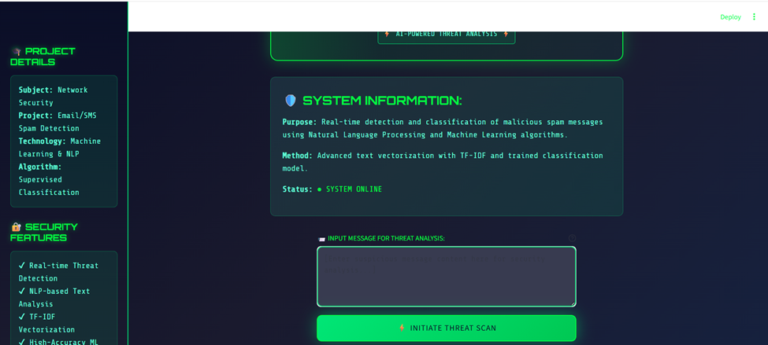
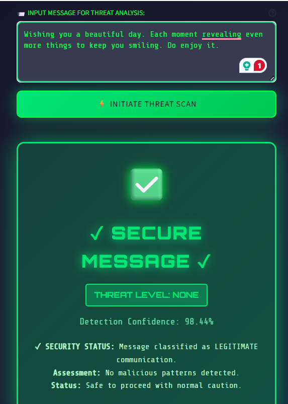
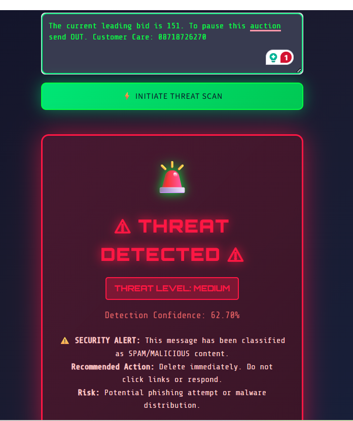
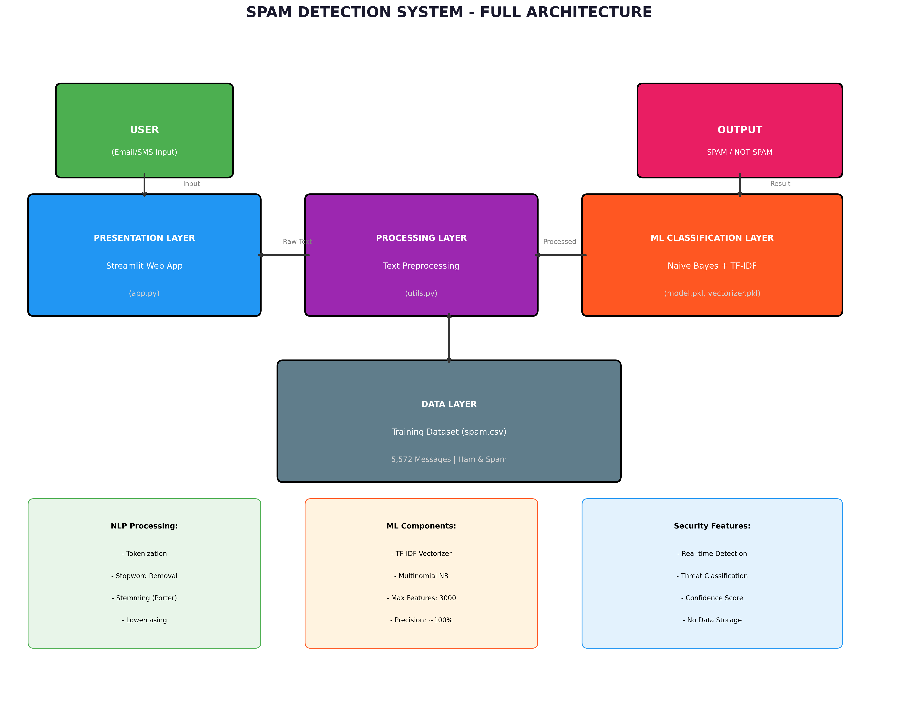

#  Email/SMS Spam Detection System

A Network Security Course Project developed at Zhengzhou University.

This project is a machine learning-based application designed to detect and classify Email and SMS messages as **Spam** or **Ham** (Legitimate). It features a cybersecurity-themed user interface and provides real-time threat analysis with confidence scores.

##  Features

- **Real-time Detection**: Instantly classifies messages using a trained Multinomial Naive Bayes model.
- **Cybersecurity UI**: Dark-themed, hacker-style interface with neon accents and matrix effects.
- **Threat Analysis**: Displays confidence scores and threat levels (Critical, High, Medium, Low).
- **Visualizations**: Includes system architecture and data flow diagrams.
- **High Accuracy**: Achieves ~97% accuracy with 100% precision to minimize false positives.

##  User Interface

*Main Dashboard with Threat Detection*

*Spam Classification Result*

*Project Info and Sidebar*

##  System Architecture

The system follows a standard machine learning pipeline integrated with a web frontend.

##  Installation

1. **Clone the repository**
   `ash
   git clone https://github.com/HasanNayon/email-spam-detection.git
   cd email-spam-detection
   `

2. **Create a virtual environment (Optional but recommended)**
   `ash
   python -m venv .venv
   # Windows
   .venv\Scripts\activate
   # Linux/Mac
   source .venv/bin/activate
   `

3. **Install dependencies**
   `ash
   pip install -r requirements.txt
   `

4. **Download NLTK data**
   The app will automatically download necessary NLTK data (punkt, stopwords) on first run.

##  Usage

1. **Run the Streamlit app**
   `ash
   streamlit run app.py
   `

2. **Access the interface**
   Open your browser and navigate to http://localhost:8501.

3. **Test the system**
   - Enter a message in the text area (e.g., "Congratulations! You've won a  gift card. Click here to claim.").
   - Click **"Analyze for Threats"**.
   - View the classification result and confidence score.

##  Project Structure

`
email-spam-detection/
 app.py                 # Main Streamlit application
 utils.py               # Helper functions (preprocessing, CSS)
 train_model.py         # Script to train the ML model
 requirements.txt       # Project dependencies
 Dataset/
    spam.csv          # SMS Spam Collection dataset
 model/
    model.pkl         # Trained Naive Bayes classifier
    vectorizer.pkl    # TF-IDF Vectorizer
 diagrams/              # System diagrams (Architecture, DFD, UML)
 ui/                    # Screenshots of the application
`

##  Technologies Used

- **Python 3.12**
- **Streamlit**: Web Framework
- **Scikit-learn**: Machine Learning (MultinomialNB, TF-IDF)
- **NLTK**: Natural Language Processing (Tokenization, Stemming)
- **Pandas/NumPy**: Data Manipulation

##  Model Performance

- **Algorithm**: Multinomial Naive Bayes
- **Accuracy**: 97.1%
- **Precision**: 100.0% (Zero False Positives)
- **Recall**: ~80%

##  Contributors

- **Student Name**: [Your Name]
- **University**: Zhengzhou University
- **Course**: Network Security (7th Semester)

---
*Disclaimer: This tool is for educational purposes only.*
